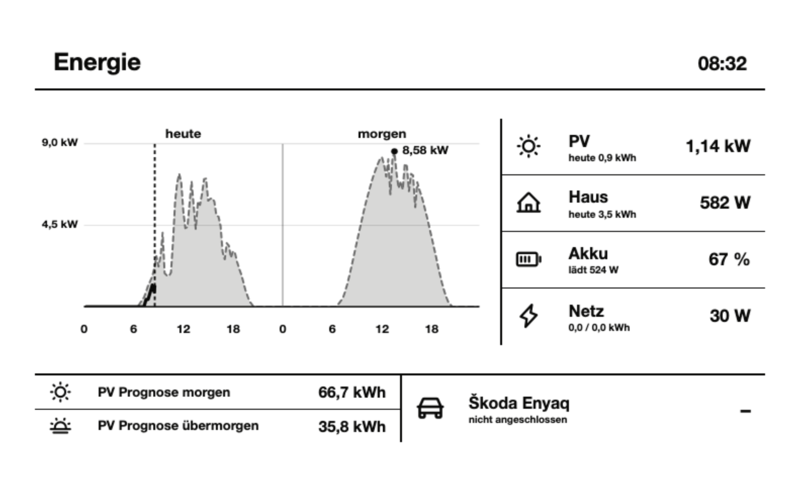
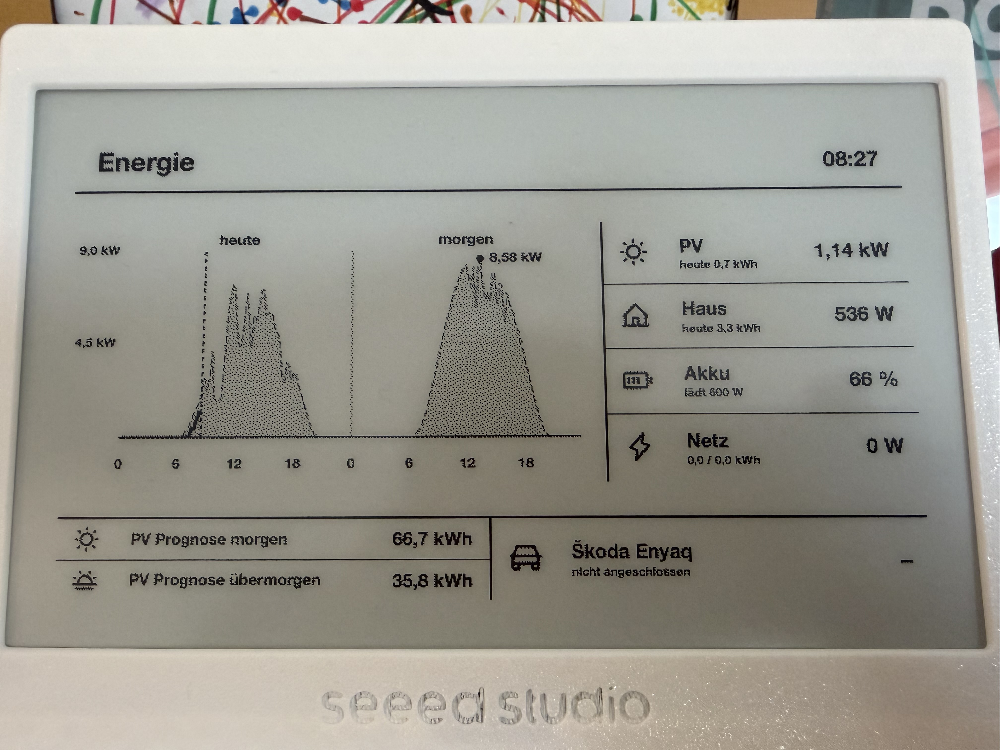

# EVCC, Energy

A [Tesserae](https://tesserae.ink) widget for [evcc](https://evcc.io). Live house energy plus a two-day PV chart that overlays **actual** production on the **forecast**.





## Install

In Tesserae: **Settings → Widgets → Browse catalog → EVCC, Energy**, or copy this folder to `plugins/evcc_energy/` and restart.

Set **EVCC URL** to your instance, e.g. `http://192.168.1.10:7070`. The widget calls only that host (`GET /api/state`, `GET /api/history/energy`). No API key.

## Options

| Option | Meaning |
| --- | --- |
| EVCC URL | Base URL (`http` or `https`) |
| Loadpoint index | Charger to show (`0` = first) |
| Title | Header; empty uses Energy / Energie |
| Language | Deutsch or English |
| Vehicle name | Fallback when no car is connected |
| Show vehicle | Footer vehicle panel |
| Show forecast footer | Tomorrow / day-after totals |

## Layout

- Chart: today + tomorrow — forecast dashed, actual solid
- Stats: PV, house, battery, grid (live power and today’s kWh)
- Footer: PV forecast and optional vehicle

## Develop

```sh
# Tesserae checkout, this folder at plugins/evcc_energy/
.venv/bin/python -m pytest plugins/evcc_energy/tests -q
```

Preview: `/_test/render?plugin=evcc_energy&size=lg`

## Notes

Private hobby project. I use this repo mainly as a backup. I take **no responsibility** if you install it, break something, or lose data. Feedback is welcome.

Built with [Cursor](https://cursor.com) and **Cursor Grok 4.6 High**.

## License

[AGPL-3.0-or-later](LICENSE), same as Tesserae.
